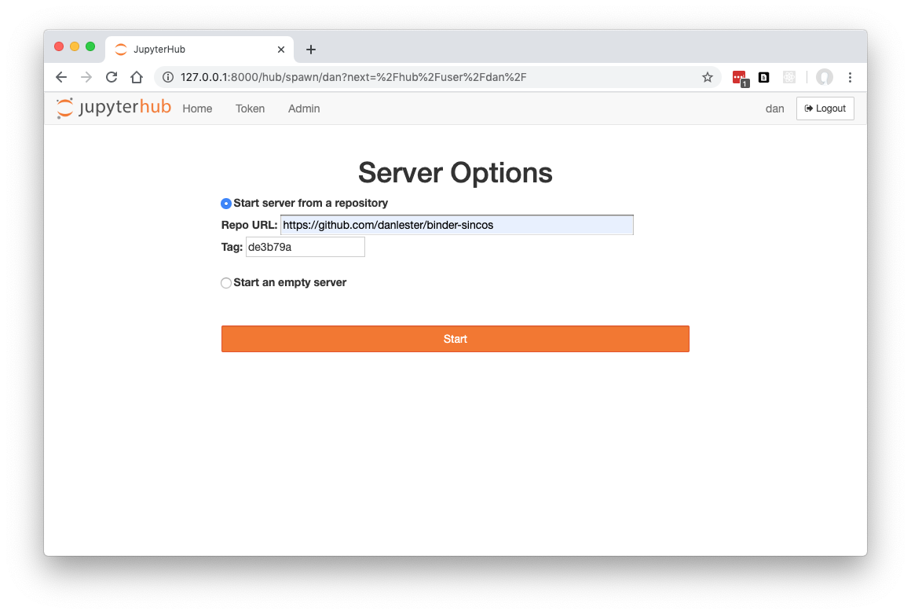
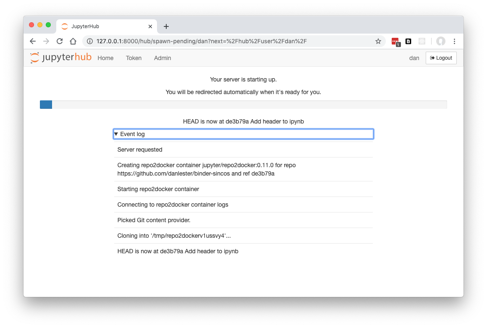

# Repo2DockerSpawner

**Repo2DockerSpawner** enables [JupyterHub](https://github.com/jupyterhub/jupyterhub) 
to spawn single user notebook servers in Docker containers, with the ability to create new Docker images via 
[Repo2Docker](https://repo2docker.readthedocs.io/en/latest/).

This is an extension of [DockerSpawner](https://github.com/jupyterhub/dockerspawner) which also includes a 'Binder' form for repo2docker:



## How it works

If a repo URL (and optional ref) is supplied via the form above, repo2docker will be run inside a Docker container.

Whereas fully-fledged user interfaces such as mybinder.org will carry out their own github API requests etc to check the ref and calculate the name of an image to build, Repo2DockerSpawner passes everything into repo2docker which takes care of all of this itself anyway. Because Repo2DockerSpawner isn't responsible for setting the image name and checking if it already exists, instead if monitors logs carefully so it can pick up the resulting image name on successful build.

Logs are also passed on to the /spawn-pending/ logs page:



Builds are run on a pool of background threads (you can specify the number of concurrent build threads allowed), mainly delegating to the Docker daemon for execution of the repo2docker containers of course.

This is strictly an alpha version and should be used with caution.

## Installation

Via pip:

```
pip install repo2dockerspawner
```

## Configuration

In your jupyterhub_config.py file:

```python
    c.JupyterHub.spawner_class = 'repo2dockerspawner.Repo2DockerSpawner'
```

All DockerSpawner options are still available and can be set on the super class, e.g. the default singleuser image:

```python
c.DockerSpawner.image = 'jupyter/scipy-notebook:8f56e3c47fec'
```

### Repo2DockerSpawner extra options

Specify the image to use for repo2docker builds:

```python
    c.Repo2DockerSpawner.build_image = 'jupyter/repo2docker:0.11.0'
```

```python
    c.Repo2DockerSpawner.concurrent_builds_limit = 20
```

Number of threads to allocate globally for repo2docker builds.

If set to 0, the ThreadPoolExecutor default will be used.

## Support

Please email general feedback and suggestions to [dan@ideonate.com](mailto:dan@ideonate.com).
